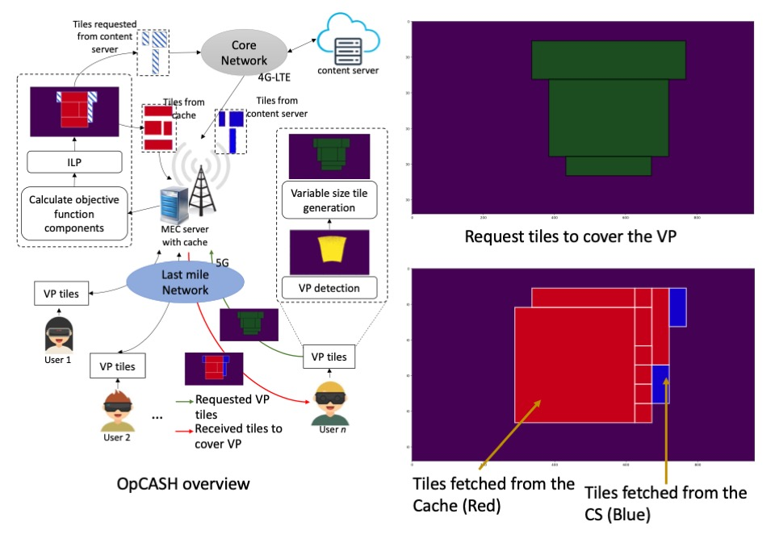
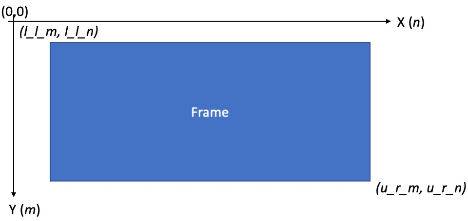

# OpCASH
Code repository for the paper OpCASH: Optimized Utilization of MEC Cache for 360-Degree Video Streaming with Dynamic Tiling

This repository holds the artifacts to generate the main results of the OpCASH.

## Requirements
Following packages are required.

* Numpy				
*	Pandas			
*	matplotlib
*	scikit-image      0.16.2
*	glpk              0.4.6
*	networkx          2.4

## Breif overview of OpCASH
360-degree videos a.k.a. spherical videos have become popular creating an immersive streaming experience for the user, nevertheless, these videos demand high bandwidth in operational networks and have strict latency requirements. Viewport (VP) aware streaming with variable tiling has been proposed as a promising solution to reduce bandwidth consumption while providing fine granularity to the user VP. Content caching at the edge has also been proposed to reduce the delivery latency. Though, combining these two mechanisms have potential advantages, applying conventional tile-based caching, which primarily tries to find identical tiles, is not feasible due to the high diversity in tile area and location in variable tiles. 
To this end, we propose **OpCASH**, an ILP based mechanism to devise optimal cache tile configuration at a MEC server to provide a non-overlapping tile cover for a given VP request in variable tiles, while minimizing the requests to remote servers and reducing the delivery latency. 
Experimental trace-driven simulation results show that we can achieve more than 95\% of VP coverage from cache after just 24 views of the video. Compared to a baseline which represents conventional tile-based caching,  **OpCASH** reduces the data fetched from the content servers by 85\% and total  content  delivery  time  by  74\%. 

Overall process and sample tile configuration (Cache+CS) to cover a requested VP

 

## Run the script
To run the script clone the repository to your local repository and install the required packages above. Then run the command
`python3 opcash_main.py`

## How the code works
The input data (used in test purpose) is provided in the below folders

* Tile_info_DT  : Variable tile information of the users (for each video and each chunk). In a given `.csv` file, DT information is given as follows.
  * l_l_m: lower left y
  * l_l_n: lower left x
  * u_r_m: upper right y
  * u_r_n: upper right x
  
  Frame cooridinate system
  
  

* Tile_info_BT : Basic tile size information for 10 x 20 configuration for each video frame. We consider the first frame of a given chunk as a representative frame for the chunk.
* BW_traces    : Bw traces for 4G. We use these traces mainly for the time calculations for data transmission. Moreover, we consider both 4G and 5G traces (in our case 2 representative values) for variable quality tile streaming. Codes for these experiments will be uploaded soon...
* Data_store_path: Folder to store the tile information processed by OpCASH. We have provided the results for the first video in the test video sets. Format of the folder is as follows.
  * Video : There 6 test videos. Result for the first video has been already given in `.zip` file
    * User order of video streaming : There 3 randomly created orders
      * Chunk : There 120 chunks of 0.5 s long.
        * User : There 30 users.
          * `D.csv` : Matrix D values
          * `cost_r.csv` : cost vector r for each identified cached tiles
          * `cost_e.csv` : cost vector e for each identified cached tiles
          * `cost_s.csv` : cost vector s for each identified cached tiles
          * `overlapped_cts.csv`: coordinates of overlapped cached tiles
          * `tiles_cts.csv` : selected cached tiles to cover the user VP
          * `tiles_new.csv` : new tiles fetched from CS to cover the user VP
          * `total_cts` : cached tiles stored in the MEC upto _n_ number of user
        

